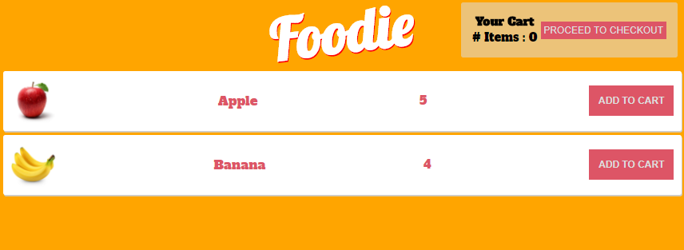

# Foodie

A Sample project for learing Angular 2+ frontend framework

This project was generated with [Angular CLI](https://github.com/angular/angular-cli) version 1.4.2.

## Development server

Run `ng serve` for a dev server. Navigate to `http://localhost:4200/`. The app will automatically reload if you change any of the source files.

